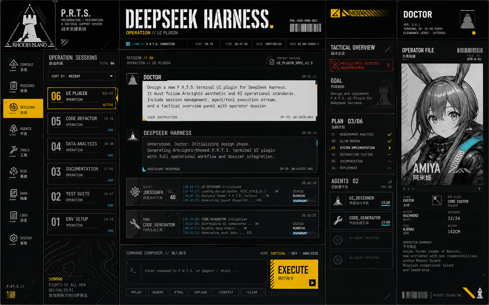

# DSH P.R.T.S. Personal UI Plugin Design

Date: 2026-08-21
Status: Approved design, pending implementation plan
Target: DeepSeek Harness Web `0.1.0-rc.7` in the existing Docker deployment
Package name: `dsh-theme-prts`

## Summary

`dsh-theme-prts` is a personal, non-commercial fan UI plugin for DeepSeek Harness. It keeps Harness's chat and coding workflow intact while presenting conversations, goals, plans, tools, subagents, and deliverables as a P.R.T.S.-style tactical operations console.

The plugin uses Harness's supported `dsh.client` package mechanism. It combines native runtime/settings/layout/conversation/sidebar extension points with a scoped CSS theme and a small, isolated DOM compatibility layer. It does not fork the Harness frontend or modify the Docker image.

The design deliberately uses immediately recognizable Arknights fan-theme anchors: a redrawn Rhodes Island emblem, P.R.T.S. identity, RIIC terminology, operation dossiers, operator files, class-like pictograms, warning geometry, cartographic textures, and a redrawn Amiya dossier. It does not extract or redistribute game screenshots.

## Visual Reference

The concept image is the visual source of truth for composition, density, contrast, and franchise recognition. The implementation must recreate its interface with HTML, CSS, React, and SVG. The full image must not be used as a flattened application background.

## Confirmed Context

- The deployed container is `deepseek-harness:0.1.0-rc.7`.
- The service is healthy and exposed at `192.168.10.106:3080`.
- The Compose project persists `/data` and `/workspace`.
- The Web profile loads client plugins through `window.__DSH_BOOT__` and `dsh.client` bundle rows.
- Existing installed examples include `dsh-theme-stardew`, `dsh-skin-market`, and `open-sea-skin`.
- A profile plugin installed under `/data/profiles/web` survives container recreation because `/data` is bind-mounted.

## Goals

1. Give the DSH Web surface an unmistakable Arknights/P.R.T.S. fan-interface identity.
2. Give ordinary chat/coding and task/agent/tool telemetry equal visual priority.
3. Preserve every existing Harness action and data flow.
4. Provide complete dark and light themes.
5. Support high-density desktop layouts and a functional tablet layout.
6. Install, upgrade, disable, and remove cleanly in the current Docker deployment.
7. Degrade safely when a Harness extension point or selector changes.

## Non-goals

- Replacing or forking the Harness Web application.
- Changing agent, model, tool, permission, or session semantics.
- Reimplementing Harness APIs or storing session data independently.
- Shipping extracted game screenshots, audio, or files copied from a game installation.
- Treating the concept image as the rendered application.
- Building a public theme marketplace in the first version.
- Providing a fully featured phone control center; phones receive a compact, usable chat fallback.

## Experience Architecture

### Desktop

The desktop shell has four working regions beneath a global P.R.T.S. status bar:

1. **Navigation rail** — conversations, tasks, workspace, skills, data/logs, and settings.
2. **Operation sessions** — pinned/recent sessions and the active workspace.
3. **Main operation stream** — conversation, code, tool/agent events, and the command composer.
4. **Tactical overview** — Goal, Plan, Agents, Tools, Deliverables, context load, and an optional operator dossier.

The main operation stream always receives the largest flexible column. The tactical overview is collapsible. Long code and deliverables must not be squeezed below a usable reading width.

### Tablet

At tablet widths, the navigation rail and main stream remain visible. The session list and tactical overview become left and right drawers. Both drawers are keyboard accessible, close on Escape, restore focus to their trigger, and never cover the command composer without an explicit user action.

### Phone fallback

At phone widths, only compact navigation, the conversation stream, command composer, essential task state, and settings are guaranteed. Operation sessions and tactical details open as full-width overlays. This is a compatibility fallback, not a miniature four-column dashboard.

## Visual System

### Franchise recognition anchors

- Redrawn Rhodes Island triangular tower emblem in the global brand area.
- Prominent `P.R.T.S.`, `RHODES ISLAND`, and operation identity labels.
- RIIC-like module names and operator-file framing.
- Redrawn Amiya dossier as the default optional character module.
- Large operation numbers, barcodes, clearance labels, map contours, halftone blocks, diagonal cuts, and yellow-black warning bands.
- Tool, agent, goal, and output pictograms modeled after the visual grammar of class and facility icons while representing DSH concepts.

These anchors are first-class assets, not faint background decoration. Removing the character dossier must still leave the interface immediately recognizable through the emblem, typography, layout, and operation graphics.

### Dark theme

- Charcoal-black base and near-black navigation rail.
- Cold white primary text and muted gray telemetry.
- Rhodes yellow for active operations and execution actions.
- Cyan for stable links and live computational activity.
- Red only for errors, denied permissions, and destructive states.
- Sparse scanlines and topographic textures kept below text contrast thresholds.

### Light theme

- Cold white and pale gray fractured panels.
- Black typography and structural rules.
- The same yellow/cyan/red semantic accents as dark mode.
- Dark navigation rail retained as a visual anchor.
- No warm paper or cream treatment; this remains an industrial operations surface.

### Typography

- Heavy condensed display face for operation titles and large numbers.
- Monospaced face for telemetry, IDs, timestamps, paths, and status labels.
- Readable sans-serif for Chinese and long assistant responses.
- Local/self-hosted font files only. System fallbacks must preserve layout.

### Motion

- Short scan, status, drawer, and progress transitions between 120 and 220 ms.
- No looping flashes or large parallax movement.
- `prefers-reduced-motion: reduce` removes nonessential transitions and animated textures.

## DSH Concept Mapping

| Harness concept | P.R.T.S. presentation |
| --- | --- |
| Session | Operation Session |
| Goal | Operation Goal |
| Plan | Operation Phases |
| Subagent | Operator |
| Tool call | Tactical Tool / Device |
| Deliverable | Mission Output |
| Model | Neural Module |
| Permission preset | Clearance Level |
| Workspace | RIIC Workspace |
| User | Doctor |
| Assistant | P.R.T.S. / DSH Core |

These are display labels only. Original semantics and accessible labels remain available where changing them would cause ambiguity.

## Components and Interaction

### Global status bar

Displays DSH connection, current model, permission preset, active session ID, and theme controls. It uses existing runtime state and adds no polling endpoint.

### Operation sessions

Uses the existing session collection and actions. Selection, rename, pin, archive, and create behaviors stay unchanged. Active state uses an operation number, yellow marker, and status code.

### Conversation stream

User and assistant messages remain normal readable blocks. Long prose and code are not forced into decorative dossier cards. Labels and corner marks establish the theme without reducing line length or copyability.

### Tactical event strips

Tool calls, agent activity, workflow runs, and plan transitions render as compact event strips. Existing disclosure controls reveal arguments, logs, errors, and results. Status is always conveyed by text/icon as well as color.

### Tactical overview

Aggregates existing Goal, Plan, Agent, Tool, Deliverable, and context information. Sections may collapse independently. The entire panel can be hidden and its state persists locally.

### Operator dossier

Shows the active AI core or a decorative character dossier. Version one ships a redrawn Amiya fan-art asset. The user can disable character art independently from the rest of the theme. Future asset packs can replace this module without changing the shell.

### Command composer

Preserves attachment, skill, model, permission, and send controls. `EXECUTE` is the visual label for the existing send action. Keyboard submission behavior is unchanged.

### Theme settings

The Harness general settings surface receives a `P.R.T.S. Fan Theme` section with:

- master enable/disable;
- dark/light/system appearance behavior;
- operator dossier on/off;
- texture strength: off, restrained, full;
- motion: system, reduced, full;
- information density: comfortable, tactical;
- reset theme settings.

## Technical Architecture

### Package entry points

- `src/index.ts` exports an empty Cordis-compatible `apply()` host entry.
- `src/client/index.tsx` registers the browser plugin.
- `cordis.patch.yml` inserts `dsh-theme-prts` into the Web client roster.
- `package.json` declares `dsh.bundle.patch`, `dsh.client.platform: web`, and immediate loading.

### Browser modules

1. **bootstrap** — parses safe mode, loads settings, and owns mount/unmount cleanup.
2. **theme store** — validates and persists namespaced preferences.
3. **theme tokens** — applies light/dark variables under `html[data-dsh-prts]`.
4. **settings integration** — registers controls through Harness settings/runtime/locale services.
5. **slot integration** — decorates sidebar, layout, conversation, and task surfaces where supported.
6. **compatibility adapter** — handles the few remaining DOM hooks and version-specific fallbacks.
7. **asset registry** — exposes local SVG, font, texture, and dossier assets.

Each module returns or registers a cleanup operation. Disabling or unloading the theme removes attributes, injected nodes, observers, listeners, styles, and runtime registrations owned by the plugin.

### Dependency strategy

The client bundle uses Harness-provided React/runtime/UI modules through the client module loader. Third-party dependencies are minimized and bundled only when Harness does not provide an equivalent. No runtime CDN is allowed.

## State and Data Flow

1. Harness loads the client bundle from the profile roster.
2. Bootstrap exits immediately when `prts-safe=1` is present.
3. The theme store loads and validates `dsh.ui.prts.v1` from local storage.
4. When disabled, only the settings registration remains active.
5. When enabled, bootstrap applies the root theme attribute and registers supported slot decorations.
6. Runtime services feed existing session/model/permission/task state to visual components.
7. Setting changes update the store and UI immediately without reloading.
8. Disable/unload runs cleanup in reverse registration order.

The plugin reads only state already exposed to the Web client. It creates no telemetry, analytics, remote asset, or independent session API.

## Compatibility and Failure Handling

- Stable Harness services and `data-slot`/`data-testid` hooks are preferred.
- CSS-module hashes are permitted only inside one versioned compatibility file for rc.7.
- Missing optional services disable only the affected enhancement.
- A top-level mount failure logs one namespaced warning, removes partial UI, and leaves default Harness usable.
- `?prts-safe=1` prevents all visual mounting while leaving the package installed.
- Theme CSS is scoped beneath `html[data-dsh-prts]`; no global rule may remain active after disable.
- The default theme remains disabled after installation until the user opts in.

## Docker Delivery

1. Build a versioned `dsh-theme-prts-<version>.tgz` package.
2. Place the tarball in a path visible through the persistent `/workspace` mount.
3. Install it with `dsh plugin --profile web add <tarball>` inside the running container.
4. Restart the `deepseek-harness` Compose service.
5. Enable the theme from Harness settings.

Because the Web profile lives under the persisted `/data` mount, image replacement does not remove the installed package. Updates use a new tarball and the profile plugin update/add workflow. Uninstall removes the package and restarts the service. Safe mode is the recovery path when UI access is impaired.

## Asset and Rights Boundary

- This is explicitly labeled a personal, non-commercial fan theme.
- Code and original SVG/UI implementation can use a permissive license.
- Redrawn franchise-identifying assets and character art are stored separately and are not represented as covered by the code license.
- No screenshots or files extracted from the game are packaged.
- A future public release requires a separate rights and redistribution review; it is not assumed by this design.

## Testing

### Unit tests

- settings validation, migration, and reset;
- safe-mode parsing;
- theme attribute lifecycle;
- cleanup stack behavior;
- compatibility adapter behavior when selectors/services are absent.

### Browser component tests

- settings controls and persistence;
- enable/disable without reload;
- tactical panel collapse and focus restoration;
- event-strip disclosure;
- reduced-motion behavior;
- character dossier toggle.

### Playwright acceptance

- dark and light theme screenshots at desktop and tablet widths;
- 1440p, 1024px, 768px, and 200% zoom layouts;
- long assistant prose, long code, tool results, agent activity, Goal/Plan, and Deliverables;
- keyboard-only navigation and visible focus;
- safe mode and full theme rollback;
- no console errors during mount, disable, re-enable, and navigation;
- live validation against `deepseek-harness:0.1.0-rc.7` in the existing Docker service.

## Acceptance Criteria

1. The first view is immediately recognizable as an Arknights/P.R.T.S. fan interface.
2. Chat, code, tools, agents, goals, plans, deliverables, and settings remain functional.
3. Dark and light modes are complete rather than simple color inversions.
4. Desktop shows the full operations layout; tablet uses drawers without losing actions.
5. Disabling the theme restores default Harness without residual nodes or styles.
6. Safe mode always exposes an unthemed, usable Harness page.
7. Primary text and controls meet WCAG AA contrast; all actions are keyboard reachable.
8. The package installs from a local tarball into the persisted Docker Web profile.
9. Automated tests pass and the real rc.7 Docker instance completes the acceptance flow.

## Implementation Boundary

The first implementation covers the core shell, both themes, settings, conversation/event styling, tactical overview, the default dossier, responsive behavior, safe mode, packaging, and tests. Additional operator art packs, audio, a public marketplace, and support for Harness versions not tested during implementation are deferred.
